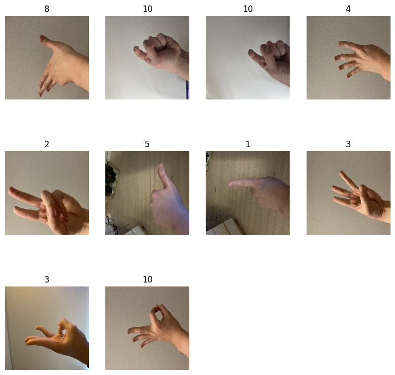
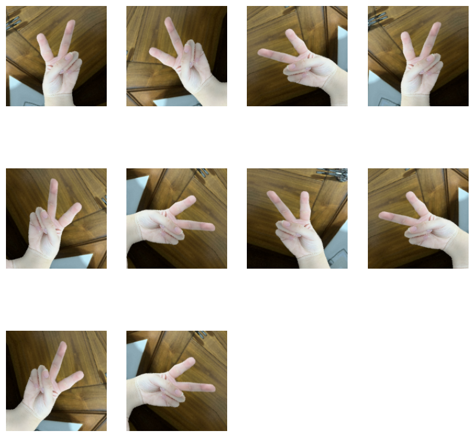
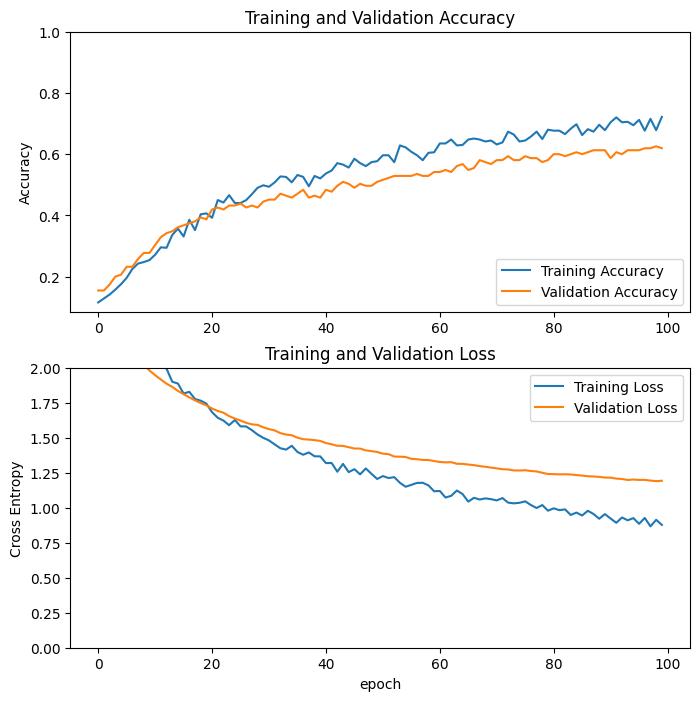
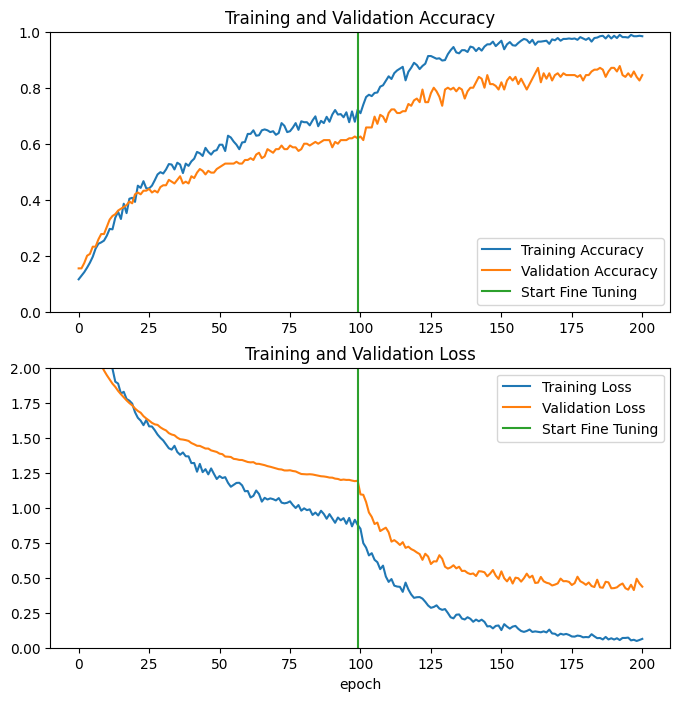
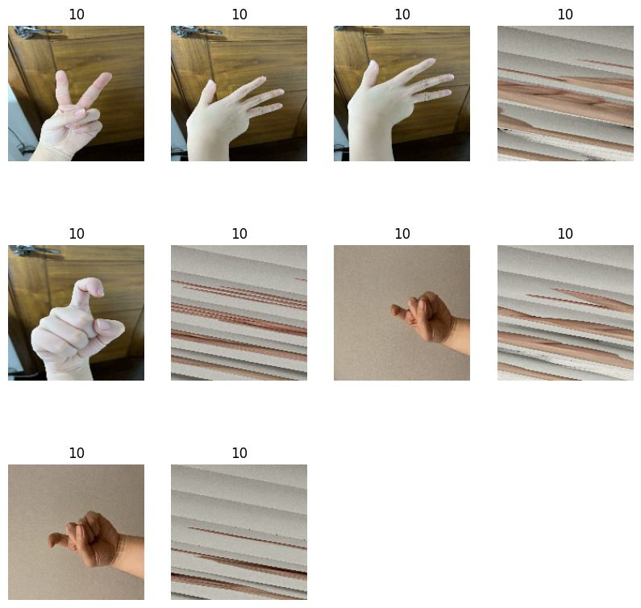

<a href="https://colab.research.google.com/github/gain16/portfolioAI/blob/master/Sign_Language_Image_Classification_with_Transfer_learning.ipynb" target="_parent"></a>

# Transfer Learning to predict Sign Language images

### Your own image classification system
- Create an image classification system using a variety of sign Language images, rather than relying solely on the pre-existing sample data provided by Tensorflow.
- Finding the right model training when you don't have enough training data to achieve adequate production performance due to many constraints in the data collection process.
- Check the process of learning with a limited amount of data using an already trained learning model.

## Setup

Import TensorFlow and other necessary libraries:


```python
import matplotlib.pyplot as plt
import numpy as np
import os
import tensorflow as tf

import keras
from keras.models import Sequential
```

## Data preprocessing

### Data downLoad and prepare (Google Drive Mount)


```python
from google.colab import drive
drive.mount('/content/gdrive')
```

    Mounted at /content/gdrive
    


```python
import shutil

shutil.copy('/content/gdrive/MyDrive/Colab Notebooks/CV_sign_language_filterted/sign_language_filtered.zip', '/content/')
```


    '/content/sign_language_filtered.zip'


```python
# It will delete existing generated files on repeated runs.
#반복적인 실행시 기존의 생성된 파일을 삭제해 줍니다.
root_dir = '/content'

import os

if os.path.exists(os.path.join(root_dir, 'sign_language_filtered')):
    shutil.rmtree(os.path.join(root_dir, 'sign_language_filtered'))
```


```python
# Import the compressed file module.
# 압축파일 모듈 import해 줍니다.
import zipfile

# Use the Python with function to make the sign_language_filtered.zip file accessible as target_file.
# 파이썬 with함수를 사용해서 sign_language_filtered.zip 파일을 target_file으로 접근하게 만듭니다.
with zipfile.ZipFile(os.path.join(root_dir, 'sign_language_filtered.zip'), mode='r') as target_file: # mode='r' (읽기 모드)

  target_file.extractall(os.path.join(root_dir, 'sign_language_filtered')) # Unzip the zip file to that path.(해당 경로에 zip파일을 해제)
```


```python
# Convert HEIC files to jpegs
# HEIC파일을 jpeg파일로 변환

!pip install pyheif
!pip install Pillow

# import os(처음에 지정해줌)
import pyheif
from PIL import Image

root_dir = '/content'
dataset_class = ['train','test']

for dataset_name in dataset_class:
  folder_path = os.path.join(root_dir, 'sign_language_filtered', dataset_name)
  for label in range(1, 11):
    class_folder = os.path.join(folder_path, str(label))
    for filename in os.listdir(class_folder):
        if filename.lower().endswith(".heic"):
           input_path = os.path.join(class_folder, filename)
           output_path = os.path.join(class_folder, f"{os.path.splitext(filename)[0]}.jpeg")

           heif_file = pyheif.read(input_path)
           image = Image.frombytes(
              heif_file.mode,
              heif_file.size,
              heif_file.data,
              "raw"
           )
           image.save(output_path, "jpeg")
           os.remove(input_path) #기존 HEIC파일 제거
```

    Collecting pyheif
      Downloading pyheif-0.7.1-cp310-cp310-manylinux_2_17_x86_64.manylinux2014_x86_64.whl (9.8 MB)
         ━━━━━━━━━━━━━━━━━━━━━━━━━━━━━━━━━━━━━━━━ 9.8/9.8 MB 11.6 MB/s eta 0:00:00
    [?25hRequirement already satisfied: cffi>=1.0.0 in /usr/local/lib/python3.10/dist-packages (from pyheif) (1.16.0)
    Requirement already satisfied: pycparser in /usr/local/lib/python3.10/dist-packages (from cffi>=1.0.0->pyheif) (2.21)
    Installing collected packages: pyheif
    Successfully installed pyheif-0.7.1
    Requirement already satisfied: Pillow in /usr/local/lib/python3.10/dist-packages (9.4.0)
    

Checking data quantity after download completion

* Train images are 777

    (Since there are few train images, we use the previously trained model for learning - Transfer learning)
* 330 test images

There are 1107 images in total.


```python
train_dir = os.path.join(root_dir, 'sign_language_filtered/train/')
test_dir = os.path.join(root_dir, 'sign_language_filtered/test/')
```


```python
import pathlib
from pathlib import Path

train_dir = pathlib.Path(train_dir)
test_dir = pathlib.Path(test_dir)

# 훈련용데이터셋 과 테스트용데이터셋의 이미지수량을 확인한다.
train_image_count = len(list(train_dir.glob('*/*.*'))) #glob는 문자열 객체에서 호출할수 없다. 그래서 pathlib.path를 사용
test_image_count = len(list(test_dir.glob('*/*.*')))   #왜 */*으로 가운데 '/'가 들어가는지 확인하기

print(train_image_count)
print(test_image_count)
total = int(train_image_count) + int(test_image_count)
print(total)
```

    777
    330
    1107
    

### Create a dataset

Define some parameters for the loader:


```python
BATCH_SIZE = 32
IMG_SIZE = (160, 160)
```

Since we don't have a validation dataset, we use 80% of the images for training and 20% for validation.


```python
train_ds = tf.keras.utils.image_dataset_from_directory(
  train_dir,
  validation_split=0.2,
  subset="training",
  seed=123,
  image_size=IMG_SIZE,
  batch_size=BATCH_SIZE)
```

    Found 777 files belonging to 10 classes.
    Using 622 files for training.
    


```python
val_ds = tf.keras.utils.image_dataset_from_directory(
  train_dir,
  validation_split=0.2,
  subset="validation",
  seed=123,
  image_size=IMG_SIZE,
  batch_size=BATCH_SIZE)
```

    Found 777 files belonging to 10 classes.
    Using 155 files for validation.
    


```python
test_ds = tf.keras.utils.image_dataset_from_directory(
  test_dir,
  validation_split=None,
  subset=None,
  seed=123,
  image_size=IMG_SIZE,
  batch_size=BATCH_SIZE)
```

    Found 330 files belonging to 10 classes.
    

### Visualize the data

Output the first 10 images from the training dataset

You can find the class names in the `class_names` attribute of these datasets.


```python
class_names = train_ds.class_names
print(class_names)

plt.figure(figsize=(10, 10))
for images, labels in train_ds.take(1):
  for i in range(0,10): # 0부터 10직전까지 (0~9)
    ax = plt.subplot(3, 4, i + 1)
    plt.imshow(images[i].numpy().astype("uint8"))
    plt.title(class_names[labels[i]])
    plt.axis("off")
```

    ['1', '10', '2', '3', '4', '5', '6', '7', '8', '9']
    


    

    


```python
for image_batch, labels_batch in train_ds: # tf.keras.utils.image_dataset_from_directory으로 데이터 셋을 만들때 batch사이즈를 정해 주었다.
  print(image_batch.shape)                 # (32, 160, 160, 3)의 의미
  print(labels_batch.shape)                # 32: 한번에 처리되는 이미지의 개수(배치크기)/32개의 이미지를 묶어 주었다는 의미미
  break                                    # 160,160: 이미지의 높이와 너비를 의미
                                           # 3: 이미지의 채널 수를 의미. 컬러 이미지는 3(R,G,B)
```

    (32, 160, 160, 3)
    (32,)
    

The `image_batch` is a tensor of the shape `(32, 160, 160, 3)` with 32 images of the shape `160x160x3` (the last dimension represents the color channel RGB). The `label_batch` is a tensor of the shape `(32,)`, with labels corresponding to the 32 images.


```python

```

### Configure the dataset for performance


```python
AUTOTUNE = tf.data.AUTOTUNE

train_ds = train_ds.cache().prefetch(buffer_size=AUTOTUNE)
val_ds = val_ds.cache().prefetch(buffer_size=AUTOTUNE)
test_ds = test_ds.cache().prefetch(buffer_size=AUTOTUNE)
```

### Use data augmentation

When you don't have a large image dataset, it's a good practice to artificially introduce sample diversity by applying random, yet realistic, transformations to the training images, such as rotation and horizontal flipping. This helps expose the model to different aspects of the training data and reduce [overfitting](https://www.tensorflow.org/tutorials/keras/overfit_and_underfit).


```python
# Data Augmenation
data_augmentation = tf.keras.Sequential([
  tf.keras.layers.RandomFlip('horizontal'),
  tf.keras.layers.RandomRotation(0.2),
])
```

Let's repeatedly apply these layers to the same image and see the result.


```python
for image, _ in train_ds.take(1):
  plt.figure(figsize=(10, 10))
  first_image = image[0]
  for i in range(10): # 0부터 10직전까지 (0~9)
    ax = plt.subplot(3, 4, i + 1)
    augmented_image = data_augmentation(tf.expand_dims(first_image, 0))
    plt.imshow(augmented_image[0] / 255)
    plt.axis('off')
```


    

    


### Rescale pixel values

In a moment, you will download `tf.keras.applications.MobileNetV2` for use as your base model. This model expects pixel values in `[-1, 1]`, but at this point, the pixel values in your images are in `[0, 255]`. To rescale them, use the preprocessing method included with the model.


```python
preprocess_input = tf.keras.applications.mobilenet_v2.preprocess_input
```

Note: Alternatively, you could rescale pixel values from `[0, 255]` to `[-1, 1]` using `tf.keras.layers.Rescaling`.


```python
rescale = tf.keras.layers.Rescaling(1./127.5, offset=-1)
```

Note: If using other `tf.keras.applications`, be sure to check the API doc to determine if they expect pixels in `[-1, 1]` or `[0, 1]`, or use the included `preprocess_input` function.

## Create a base model from a pre-trained convolutional network

Create a pre-trained base model on the ImageNet dataset using the MobileNet V2 model. Select the bottleneck layer to use for feature extraction, and use `include_top = False` to load the network excluding the classification layer.


```python
# Create the base model from the pre-trained model MobileNet V2

IMG_SHAPE = IMG_SIZE + (3,)
base_model = tf.keras.applications.MobileNetV2(input_shape=IMG_SHAPE, # 새롭게 학습시킬 이미지 텐서 크기
                                               include_top=False,     # 사전학습 모델의 특징 추출기만 가져옴/True일때,사전학습 모델의 특징추출기와 분류기 모두 가져옴
                                               weights='imagenet')    # 사전학습에 사용된 데이터셋
```

    Downloading data from https://storage.googleapis.com/tensorflow/keras-applications/mobilenet_v2/mobilenet_v2_weights_tf_dim_ordering_tf_kernels_1.0_160_no_top.h5
    9406464/9406464 [==============================] - 0s 0us/step
    

This feature extractor converts each `160x160x3` image into a `5x5x1280` block of features.


```python
image_batch, label_batch = next(iter(train_ds)) # iter를 사용하여 train_ds에서 이미지 배치를 가지고 옴
feature_batch = base_model(image_batch)         # next(iter(train_ds))를 사용하여 첫번째 이미지 배치를 선택
print(feature_batch.shape)
```

    (32, 5, 5, 1280)
    

## Feature extraction
In this step, you will freeze the convolutional base created from the previous step and to use as a feature extractor. Additionally, you add a classifier on top of it and train the top-level classifier.

### Freeze the convolutional base

It is important to freeze the convolutional base before you compile and train the model. Freezing (by setting layer.trainable = False) prevents the weights in a given layer from being updated during training. MobileNet V2 has many layers, so setting the entire model's `trainable` flag to False will freeze all of them.


```python
base_model.trainable = False
```

### Important note about BatchNormalization layers

Many models contain `tf.keras.layers.BatchNormalization` layers. This layer is a special case and precautions should be taken in the context of fine-tuning, as shown later in this tutorial.

When you set `layer.trainable = False`, the `BatchNormalization` layer will run in inference mode, and will not update its mean and variance statistics.

When you unfreeze a model that contains BatchNormalization layers in order to do fine-tuning, you should keep the BatchNormalization layers in inference mode by passing `training = False` when calling the base model. Otherwise, the updates applied to the non-trainable weights will destroy what the model has learned.


```python
# Let's take a look at the base model architecture
base_model.summary()
```

    Model: "mobilenetv2_1.00_160"
    __________________________________________________________________________________________________
     Layer (type)                Output Shape                 Param #   Connected to                  
    ==================================================================================================
     input_1 (InputLayer)        [(None, 160, 160, 3)]        0         []                            
                                                                                                      
     Conv1 (Conv2D)              (None, 80, 80, 32)           864       ['input_1[0][0]']             
                                                                                                      
     bn_Conv1 (BatchNormalizati  (None, 80, 80, 32)           128       ['Conv1[0][0]']               
     on)                                                                                              
                                                                                                      
     Conv1_relu (ReLU)           (None, 80, 80, 32)           0         ['bn_Conv1[0][0]']            
                                                                                                      
     expanded_conv_depthwise (D  (None, 80, 80, 32)           288       ['Conv1_relu[0][0]']          
     epthwiseConv2D)                                                                                  
                                                                                                      
     expanded_conv_depthwise_BN  (None, 80, 80, 32)           128       ['expanded_conv_depthwise[0][0
      (BatchNormalization)                                              ]']                           
                                                                                                      
     expanded_conv_depthwise_re  (None, 80, 80, 32)           0         ['expanded_conv_depthwise_BN[0
     lu (ReLU)                                                          ][0]']                        
                                                                                                      
     expanded_conv_project (Con  (None, 80, 80, 16)           512       ['expanded_conv_depthwise_relu
     v2D)                                                               [0][0]']                      
                                                                                                      
     expanded_conv_project_BN (  (None, 80, 80, 16)           64        ['expanded_conv_project[0][0]'
     BatchNormalization)                                                ]                             
                                                                                                      
     block_1_expand (Conv2D)     (None, 80, 80, 96)           1536      ['expanded_conv_project_BN[0][
                                                                        0]']                          
                                                                                                      
     block_1_expand_BN (BatchNo  (None, 80, 80, 96)           384       ['block_1_expand[0][0]']      
     rmalization)                                                                                     
                                                                                                      
     block_1_expand_relu (ReLU)  (None, 80, 80, 96)           0         ['block_1_expand_BN[0][0]']   
                                                                                                      
     block_1_pad (ZeroPadding2D  (None, 81, 81, 96)           0         ['block_1_expand_relu[0][0]'] 
     )                                                                                                
                                                                                                      
     block_1_depthwise (Depthwi  (None, 40, 40, 96)           864       ['block_1_pad[0][0]']         
     seConv2D)                                                                                        
                                                                                                      
     block_1_depthwise_BN (Batc  (None, 40, 40, 96)           384       ['block_1_depthwise[0][0]']   
     hNormalization)                                                                                  
                                                                                                      
     block_1_depthwise_relu (Re  (None, 40, 40, 96)           0         ['block_1_depthwise_BN[0][0]']
     LU)                                                                                              
                                                                                                      
     block_1_project (Conv2D)    (None, 40, 40, 24)           2304      ['block_1_depthwise_relu[0][0]
                                                                        ']                            
                                                                                                      
     block_1_project_BN (BatchN  (None, 40, 40, 24)           96        ['block_1_project[0][0]']     
     ormalization)                                                                                    
                                                                                                      
     block_2_expand (Conv2D)     (None, 40, 40, 144)          3456      ['block_1_project_BN[0][0]']  
                                                                                                      
     block_2_expand_BN (BatchNo  (None, 40, 40, 144)          576       ['block_2_expand[0][0]']      
     rmalization)                                                                                     
                                                                                                      
     block_2_expand_relu (ReLU)  (None, 40, 40, 144)          0         ['block_2_expand_BN[0][0]']   
                                                                                                      
     block_2_depthwise (Depthwi  (None, 40, 40, 144)          1296      ['block_2_expand_relu[0][0]'] 
     seConv2D)                                                                                        
                                                                                                      
     block_2_depthwise_BN (Batc  (None, 40, 40, 144)          576       ['block_2_depthwise[0][0]']   
     hNormalization)                                                                                  
                                                                                                      
     block_2_depthwise_relu (Re  (None, 40, 40, 144)          0         ['block_2_depthwise_BN[0][0]']
     LU)                                                                                              
                                                                                                      
     block_2_project (Conv2D)    (None, 40, 40, 24)           3456      ['block_2_depthwise_relu[0][0]
                                                                        ']                            
                                                                                                      
     block_2_project_BN (BatchN  (None, 40, 40, 24)           96        ['block_2_project[0][0]']     
     ormalization)                                                                                    
                                                                                                      
     block_2_add (Add)           (None, 40, 40, 24)           0         ['block_1_project_BN[0][0]',  
                                                                         'block_2_project_BN[0][0]']  
                                                                                                      
     block_3_expand (Conv2D)     (None, 40, 40, 144)          3456      ['block_2_add[0][0]']         
                                                                                                      
     block_3_expand_BN (BatchNo  (None, 40, 40, 144)          576       ['block_3_expand[0][0]']      
     rmalization)                                                                                     
                                                                                                      
     block_3_expand_relu (ReLU)  (None, 40, 40, 144)          0         ['block_3_expand_BN[0][0]']   
                                                                                                      
     block_3_pad (ZeroPadding2D  (None, 41, 41, 144)          0         ['block_3_expand_relu[0][0]'] 
     )                                                                                                
                                                                                                      
     block_3_depthwise (Depthwi  (None, 20, 20, 144)          1296      ['block_3_pad[0][0]']         
     seConv2D)                                                                                        
                                                                                                      
     block_3_depthwise_BN (Batc  (None, 20, 20, 144)          576       ['block_3_depthwise[0][0]']   
     hNormalization)                                                                                  
                                                                                                      
     block_3_depthwise_relu (Re  (None, 20, 20, 144)          0         ['block_3_depthwise_BN[0][0]']
     LU)                                                                                              
                                                                                                      
     block_3_project (Conv2D)    (None, 20, 20, 32)           4608      ['block_3_depthwise_relu[0][0]
                                                                        ']                            
                                                                                                      
     block_3_project_BN (BatchN  (None, 20, 20, 32)           128       ['block_3_project[0][0]']     
     ormalization)                                                                                    
                                                                                                      
     block_4_expand (Conv2D)     (None, 20, 20, 192)          6144      ['block_3_project_BN[0][0]']  
                                                                                                      
     block_4_expand_BN (BatchNo  (None, 20, 20, 192)          768       ['block_4_expand[0][0]']      
     rmalization)                                                                                     
                                                                                                      
     block_4_expand_relu (ReLU)  (None, 20, 20, 192)          0         ['block_4_expand_BN[0][0]']   
                                                                                                      
     block_4_depthwise (Depthwi  (None, 20, 20, 192)          1728      ['block_4_expand_relu[0][0]'] 
     seConv2D)                                                                                        
                                                                                                      
     block_4_depthwise_BN (Batc  (None, 20, 20, 192)          768       ['block_4_depthwise[0][0]']   
     hNormalization)                                                                                  
                                                                                                      
     block_4_depthwise_relu (Re  (None, 20, 20, 192)          0         ['block_4_depthwise_BN[0][0]']
     LU)                                                                                              
                                                                                                      
     block_4_project (Conv2D)    (None, 20, 20, 32)           6144      ['block_4_depthwise_relu[0][0]
                                                                        ']                            
                                                                                                      
     block_4_project_BN (BatchN  (None, 20, 20, 32)           128       ['block_4_project[0][0]']     
     ormalization)                                                                                    
                                                                                                      
     block_4_add (Add)           (None, 20, 20, 32)           0         ['block_3_project_BN[0][0]',  
                                                                         'block_4_project_BN[0][0]']  
                                                                                                      
     block_5_expand (Conv2D)     (None, 20, 20, 192)          6144      ['block_4_add[0][0]']         
                                                                                                      
     block_5_expand_BN (BatchNo  (None, 20, 20, 192)          768       ['block_5_expand[0][0]']      
     rmalization)                                                                                     
                                                                                                      
     block_5_expand_relu (ReLU)  (None, 20, 20, 192)          0         ['block_5_expand_BN[0][0]']   
                                                                                                      
     block_5_depthwise (Depthwi  (None, 20, 20, 192)          1728      ['block_5_expand_relu[0][0]'] 
     seConv2D)                                                                                        
                                                                                                      
     block_5_depthwise_BN (Batc  (None, 20, 20, 192)          768       ['block_5_depthwise[0][0]']   
     hNormalization)                                                                                  
                                                                                                      
     block_5_depthwise_relu (Re  (None, 20, 20, 192)          0         ['block_5_depthwise_BN[0][0]']
     LU)                                                                                              
                                                                                                      
     block_5_project (Conv2D)    (None, 20, 20, 32)           6144      ['block_5_depthwise_relu[0][0]
                                                                        ']                            
                                                                                                      
     block_5_project_BN (BatchN  (None, 20, 20, 32)           128       ['block_5_project[0][0]']     
     ormalization)                                                                                    
                                                                                                      
     block_5_add (Add)           (None, 20, 20, 32)           0         ['block_4_add[0][0]',         
                                                                         'block_5_project_BN[0][0]']  
                                                                                                      
     block_6_expand (Conv2D)     (None, 20, 20, 192)          6144      ['block_5_add[0][0]']         
                                                                                                      
     block_6_expand_BN (BatchNo  (None, 20, 20, 192)          768       ['block_6_expand[0][0]']      
     rmalization)                                                                                     
                                                                                                      
     block_6_expand_relu (ReLU)  (None, 20, 20, 192)          0         ['block_6_expand_BN[0][0]']   
                                                                                                      
     block_6_pad (ZeroPadding2D  (None, 21, 21, 192)          0         ['block_6_expand_relu[0][0]'] 
     )                                                                                                
                                                                                                      
     block_6_depthwise (Depthwi  (None, 10, 10, 192)          1728      ['block_6_pad[0][0]']         
     seConv2D)                                                                                        
                                                                                                      
     block_6_depthwise_BN (Batc  (None, 10, 10, 192)          768       ['block_6_depthwise[0][0]']   
     hNormalization)                                                                                  
                                                                                                      
     block_6_depthwise_relu (Re  (None, 10, 10, 192)          0         ['block_6_depthwise_BN[0][0]']
     LU)                                                                                              
                                                                                                      
     block_6_project (Conv2D)    (None, 10, 10, 64)           12288     ['block_6_depthwise_relu[0][0]
                                                                        ']                            
                                                                                                      
     block_6_project_BN (BatchN  (None, 10, 10, 64)           256       ['block_6_project[0][0]']     
     ormalization)                                                                                    
                                                                                                      
     block_7_expand (Conv2D)     (None, 10, 10, 384)          24576     ['block_6_project_BN[0][0]']  
                                                                                                      
     block_7_expand_BN (BatchNo  (None, 10, 10, 384)          1536      ['block_7_expand[0][0]']      
     rmalization)                                                                                     
                                                                                                      
     block_7_expand_relu (ReLU)  (None, 10, 10, 384)          0         ['block_7_expand_BN[0][0]']   
                                                                                                      
     block_7_depthwise (Depthwi  (None, 10, 10, 384)          3456      ['block_7_expand_relu[0][0]'] 
     seConv2D)                                                                                        
                                                                                                      
     block_7_depthwise_BN (Batc  (None, 10, 10, 384)          1536      ['block_7_depthwise[0][0]']   
     hNormalization)                                                                                  
                                                                                                      
     block_7_depthwise_relu (Re  (None, 10, 10, 384)          0         ['block_7_depthwise_BN[0][0]']
     LU)                                                                                              
                                                                                                      
     block_7_project (Conv2D)    (None, 10, 10, 64)           24576     ['block_7_depthwise_relu[0][0]
                                                                        ']                            
                                                                                                      
     block_7_project_BN (BatchN  (None, 10, 10, 64)           256       ['block_7_project[0][0]']     
     ormalization)                                                                                    
                                                                                                      
     block_7_add (Add)           (None, 10, 10, 64)           0         ['block_6_project_BN[0][0]',  
                                                                         'block_7_project_BN[0][0]']  
                                                                                                      
     block_8_expand (Conv2D)     (None, 10, 10, 384)          24576     ['block_7_add[0][0]']         
                                                                                                      
     block_8_expand_BN (BatchNo  (None, 10, 10, 384)          1536      ['block_8_expand[0][0]']      
     rmalization)                                                                                     
                                                                                                      
     block_8_expand_relu (ReLU)  (None, 10, 10, 384)          0         ['block_8_expand_BN[0][0]']   
                                                                                                      
     block_8_depthwise (Depthwi  (None, 10, 10, 384)          3456      ['block_8_expand_relu[0][0]'] 
     seConv2D)                                                                                        
                                                                                                      
     block_8_depthwise_BN (Batc  (None, 10, 10, 384)          1536      ['block_8_depthwise[0][0]']   
     hNormalization)                                                                                  
                                                                                                      
     block_8_depthwise_relu (Re  (None, 10, 10, 384)          0         ['block_8_depthwise_BN[0][0]']
     LU)                                                                                              
                                                                                                      
     block_8_project (Conv2D)    (None, 10, 10, 64)           24576     ['block_8_depthwise_relu[0][0]
                                                                        ']                            
                                                                                                      
     block_8_project_BN (BatchN  (None, 10, 10, 64)           256       ['block_8_project[0][0]']     
     ormalization)                                                                                    
                                                                                                      
     block_8_add (Add)           (None, 10, 10, 64)           0         ['block_7_add[0][0]',         
                                                                         'block_8_project_BN[0][0]']  
                                                                                                      
     block_9_expand (Conv2D)     (None, 10, 10, 384)          24576     ['block_8_add[0][0]']         
                                                                                                      
     block_9_expand_BN (BatchNo  (None, 10, 10, 384)          1536      ['block_9_expand[0][0]']      
     rmalization)                                                                                     
                                                                                                      
     block_9_expand_relu (ReLU)  (None, 10, 10, 384)          0         ['block_9_expand_BN[0][0]']   
                                                                                                      
     block_9_depthwise (Depthwi  (None, 10, 10, 384)          3456      ['block_9_expand_relu[0][0]'] 
     seConv2D)                                                                                        
                                                                                                      
     block_9_depthwise_BN (Batc  (None, 10, 10, 384)          1536      ['block_9_depthwise[0][0]']   
     hNormalization)                                                                                  
                                                                                                      
     block_9_depthwise_relu (Re  (None, 10, 10, 384)          0         ['block_9_depthwise_BN[0][0]']
     LU)                                                                                              
                                                                                                      
     block_9_project (Conv2D)    (None, 10, 10, 64)           24576     ['block_9_depthwise_relu[0][0]
                                                                        ']                            
                                                                                                      
     block_9_project_BN (BatchN  (None, 10, 10, 64)           256       ['block_9_project[0][0]']     
     ormalization)                                                                                    
                                                                                                      
     block_9_add (Add)           (None, 10, 10, 64)           0         ['block_8_add[0][0]',         
                                                                         'block_9_project_BN[0][0]']  
                                                                                                      
     block_10_expand (Conv2D)    (None, 10, 10, 384)          24576     ['block_9_add[0][0]']         
                                                                                                      
     block_10_expand_BN (BatchN  (None, 10, 10, 384)          1536      ['block_10_expand[0][0]']     
     ormalization)                                                                                    
                                                                                                      
     block_10_expand_relu (ReLU  (None, 10, 10, 384)          0         ['block_10_expand_BN[0][0]']  
     )                                                                                                
                                                                                                      
     block_10_depthwise (Depthw  (None, 10, 10, 384)          3456      ['block_10_expand_relu[0][0]']
     iseConv2D)                                                                                       
                                                                                                      
     block_10_depthwise_BN (Bat  (None, 10, 10, 384)          1536      ['block_10_depthwise[0][0]']  
     chNormalization)                                                                                 
                                                                                                      
     block_10_depthwise_relu (R  (None, 10, 10, 384)          0         ['block_10_depthwise_BN[0][0]'
     eLU)                                                               ]                             
                                                                                                      
     block_10_project (Conv2D)   (None, 10, 10, 96)           36864     ['block_10_depthwise_relu[0][0
                                                                        ]']                           
                                                                                                      
     block_10_project_BN (Batch  (None, 10, 10, 96)           384       ['block_10_project[0][0]']    
     Normalization)                                                                                   
                                                                                                      
     block_11_expand (Conv2D)    (None, 10, 10, 576)          55296     ['block_10_project_BN[0][0]'] 
                                                                                                      
     block_11_expand_BN (BatchN  (None, 10, 10, 576)          2304      ['block_11_expand[0][0]']     
     ormalization)                                                                                    
                                                                                                      
     block_11_expand_relu (ReLU  (None, 10, 10, 576)          0         ['block_11_expand_BN[0][0]']  
     )                                                                                                
                                                                                                      
     block_11_depthwise (Depthw  (None, 10, 10, 576)          5184      ['block_11_expand_relu[0][0]']
     iseConv2D)                                                                                       
                                                                                                      
     block_11_depthwise_BN (Bat  (None, 10, 10, 576)          2304      ['block_11_depthwise[0][0]']  
     chNormalization)                                                                                 
                                                                                                      
     block_11_depthwise_relu (R  (None, 10, 10, 576)          0         ['block_11_depthwise_BN[0][0]'
     eLU)                                                               ]                             
                                                                                                      
     block_11_project (Conv2D)   (None, 10, 10, 96)           55296     ['block_11_depthwise_relu[0][0
                                                                        ]']                           
                                                                                                      
     block_11_project_BN (Batch  (None, 10, 10, 96)           384       ['block_11_project[0][0]']    
     Normalization)                                                                                   
                                                                                                      
     block_11_add (Add)          (None, 10, 10, 96)           0         ['block_10_project_BN[0][0]', 
                                                                         'block_11_project_BN[0][0]'] 
                                                                                                      
     block_12_expand (Conv2D)    (None, 10, 10, 576)          55296     ['block_11_add[0][0]']        
                                                                                                      
     block_12_expand_BN (BatchN  (None, 10, 10, 576)          2304      ['block_12_expand[0][0]']     
     ormalization)                                                                                    
                                                                                                      
     block_12_expand_relu (ReLU  (None, 10, 10, 576)          0         ['block_12_expand_BN[0][0]']  
     )                                                                                                
                                                                                                      
     block_12_depthwise (Depthw  (None, 10, 10, 576)          5184      ['block_12_expand_relu[0][0]']
     iseConv2D)                                                                                       
                                                                                                      
     block_12_depthwise_BN (Bat  (None, 10, 10, 576)          2304      ['block_12_depthwise[0][0]']  
     chNormalization)                                                                                 
                                                                                                      
     block_12_depthwise_relu (R  (None, 10, 10, 576)          0         ['block_12_depthwise_BN[0][0]'
     eLU)                                                               ]                             
                                                                                                      
     block_12_project (Conv2D)   (None, 10, 10, 96)           55296     ['block_12_depthwise_relu[0][0
                                                                        ]']                           
                                                                                                      
     block_12_project_BN (Batch  (None, 10, 10, 96)           384       ['block_12_project[0][0]']    
     Normalization)                                                                                   
                                                                                                      
     block_12_add (Add)          (None, 10, 10, 96)           0         ['block_11_add[0][0]',        
                                                                         'block_12_project_BN[0][0]'] 
                                                                                                      
     block_13_expand (Conv2D)    (None, 10, 10, 576)          55296     ['block_12_add[0][0]']        
                                                                                                      
     block_13_expand_BN (BatchN  (None, 10, 10, 576)          2304      ['block_13_expand[0][0]']     
     ormalization)                                                                                    
                                                                                                      
     block_13_expand_relu (ReLU  (None, 10, 10, 576)          0         ['block_13_expand_BN[0][0]']  
     )                                                                                                
                                                                                                      
     block_13_pad (ZeroPadding2  (None, 11, 11, 576)          0         ['block_13_expand_relu[0][0]']
     D)                                                                                               
                                                                                                      
     block_13_depthwise (Depthw  (None, 5, 5, 576)            5184      ['block_13_pad[0][0]']        
     iseConv2D)                                                                                       
                                                                                                      
     block_13_depthwise_BN (Bat  (None, 5, 5, 576)            2304      ['block_13_depthwise[0][0]']  
     chNormalization)                                                                                 
                                                                                                      
     block_13_depthwise_relu (R  (None, 5, 5, 576)            0         ['block_13_depthwise_BN[0][0]'
     eLU)                                                               ]                             
                                                                                                      
     block_13_project (Conv2D)   (None, 5, 5, 160)            92160     ['block_13_depthwise_relu[0][0
                                                                        ]']                           
                                                                                                      
     block_13_project_BN (Batch  (None, 5, 5, 160)            640       ['block_13_project[0][0]']    
     Normalization)                                                                                   
                                                                                                      
     block_14_expand (Conv2D)    (None, 5, 5, 960)            153600    ['block_13_project_BN[0][0]'] 
                                                                                                      
     block_14_expand_BN (BatchN  (None, 5, 5, 960)            3840      ['block_14_expand[0][0]']     
     ormalization)                                                                                    
                                                                                                      
     block_14_expand_relu (ReLU  (None, 5, 5, 960)            0         ['block_14_expand_BN[0][0]']  
     )                                                                                                
                                                                                                      
     block_14_depthwise (Depthw  (None, 5, 5, 960)            8640      ['block_14_expand_relu[0][0]']
     iseConv2D)                                                                                       
                                                                                                      
     block_14_depthwise_BN (Bat  (None, 5, 5, 960)            3840      ['block_14_depthwise[0][0]']  
     chNormalization)                                                                                 
                                                                                                      
     block_14_depthwise_relu (R  (None, 5, 5, 960)            0         ['block_14_depthwise_BN[0][0]'
     eLU)                                                               ]                             
                                                                                                      
     block_14_project (Conv2D)   (None, 5, 5, 160)            153600    ['block_14_depthwise_relu[0][0
                                                                        ]']                           
                                                                                                      
     block_14_project_BN (Batch  (None, 5, 5, 160)            640       ['block_14_project[0][0]']    
     Normalization)                                                                                   
                                                                                                      
     block_14_add (Add)          (None, 5, 5, 160)            0         ['block_13_project_BN[0][0]', 
                                                                         'block_14_project_BN[0][0]'] 
                                                                                                      
     block_15_expand (Conv2D)    (None, 5, 5, 960)            153600    ['block_14_add[0][0]']        
                                                                                                      
     block_15_expand_BN (BatchN  (None, 5, 5, 960)            3840      ['block_15_expand[0][0]']     
     ormalization)                                                                                    
                                                                                                      
     block_15_expand_relu (ReLU  (None, 5, 5, 960)            0         ['block_15_expand_BN[0][0]']  
     )                                                                                                
                                                                                                      
     block_15_depthwise (Depthw  (None, 5, 5, 960)            8640      ['block_15_expand_relu[0][0]']
     iseConv2D)                                                                                       
                                                                                                      
     block_15_depthwise_BN (Bat  (None, 5, 5, 960)            3840      ['block_15_depthwise[0][0]']  
     chNormalization)                                                                                 
                                                                                                      
     block_15_depthwise_relu (R  (None, 5, 5, 960)            0         ['block_15_depthwise_BN[0][0]'
     eLU)                                                               ]                             
                                                                                                      
     block_15_project (Conv2D)   (None, 5, 5, 160)            153600    ['block_15_depthwise_relu[0][0
                                                                        ]']                           
                                                                                                      
     block_15_project_BN (Batch  (None, 5, 5, 160)            640       ['block_15_project[0][0]']    
     Normalization)                                                                                   
                                                                                                      
     block_15_add (Add)          (None, 5, 5, 160)            0         ['block_14_add[0][0]',        
                                                                         'block_15_project_BN[0][0]'] 
                                                                                                      
     block_16_expand (Conv2D)    (None, 5, 5, 960)            153600    ['block_15_add[0][0]']        
                                                                                                      
     block_16_expand_BN (BatchN  (None, 5, 5, 960)            3840      ['block_16_expand[0][0]']     
     ormalization)                                                                                    
                                                                                                      
     block_16_expand_relu (ReLU  (None, 5, 5, 960)            0         ['block_16_expand_BN[0][0]']  
     )                                                                                                
                                                                                                      
     block_16_depthwise (Depthw  (None, 5, 5, 960)            8640      ['block_16_expand_relu[0][0]']
     iseConv2D)                                                                                       
                                                                                                      
     block_16_depthwise_BN (Bat  (None, 5, 5, 960)            3840      ['block_16_depthwise[0][0]']  
     chNormalization)                                                                                 
                                                                                                      
     block_16_depthwise_relu (R  (None, 5, 5, 960)            0         ['block_16_depthwise_BN[0][0]'
     eLU)                                                               ]                             
                                                                                                      
     block_16_project (Conv2D)   (None, 5, 5, 320)            307200    ['block_16_depthwise_relu[0][0
                                                                        ]']                           
                                                                                                      
     block_16_project_BN (Batch  (None, 5, 5, 320)            1280      ['block_16_project[0][0]']    
     Normalization)                                                                                   
                                                                                                      
     Conv_1 (Conv2D)             (None, 5, 5, 1280)           409600    ['block_16_project_BN[0][0]'] 
                                                                                                      
     Conv_1_bn (BatchNormalizat  (None, 5, 5, 1280)           5120      ['Conv_1[0][0]']              
     ion)                                                                                             
                                                                                                      
     out_relu (ReLU)             (None, 5, 5, 1280)           0         ['Conv_1_bn[0][0]']           
                                                                                                      
    ==================================================================================================
    Total params: 2257984 (8.61 MB)
    Trainable params: 0 (0.00 Byte)
    Non-trainable params: 2257984 (8.61 MB)
    __________________________________________________________________________________________________
    

### Add a classification head

To generate predictions from the block of features, average over the spatial `5x5` spatial locations, using a `tf.keras.layers.GlobalAveragePooling2D` layer to convert the features to  a single 1280-element vector per image.


```python
global_average_layer = tf.keras.layers.GlobalAveragePooling2D()
feature_batch_average = global_average_layer(feature_batch)
print(feature_batch_average.shape)
```

    (32, 1280)
    

Apply a `tf.keras.layers.Dense` layer to convert these features into a single prediction per image. You don't need an activation function here because this prediction will be treated as a `logit`, or a raw prediction value. Positive numbers predict class 1, negative numbers predict class 0.


```python
prediction_layer = tf.keras.layers.Dense(10, activation='softmax') # activation함수를 지정해 주지 않으면 relu함수를 사용하게 됨.
prediction_batch = prediction_layer(feature_batch_average)         # 지금 처럼 클래스가 많은 다중 클래스 분류 모델을 만들때는 softmax함수를 사용해야 한다.
print(prediction_batch.shape)
```

    (32, 10)
    

Build a model by chaining together the data augmentation, rescaling, `base_model` and feature extractor layers using the [Keras Functional API](https://www.tensorflow.org/guide/keras/functional). As previously mentioned, use `training=False` as our model contains a `BatchNormalization` layer.


```python
inputs = tf.keras.Input(shape=(160, 160, 3))
x = data_augmentation(inputs)
x = preprocess_input(x)
x = base_model(x, training=False)
x = global_average_layer(x)
x = tf.keras.layers.Dropout(0.2)(x)
outputs = prediction_layer(x)
model = tf.keras.Model(inputs, outputs)
```

### Compile the model

Compile the model before training it. Since there are two classes, use the `tf.keras.losses.BinaryCrossentropy` loss with `from_logits=True` since the model provides a linear output.


```python
base_learning_rate = 0.0001
model.compile(optimizer=tf.keras.optimizers.Adam(learning_rate=base_learning_rate),
              loss=tf.keras.losses.SparseCategoricalCrossentropy(from_logits=True), # BinaryCrossentropy -> SparseCategoricalCrossentropy 수정해 줘야 한다.
              metrics=['accuracy'])
```


```python
model.summary()
```

    Model: "model"
    _________________________________________________________________
     Layer (type)                Output Shape              Param #   
    =================================================================
     input_2 (InputLayer)        [(None, 160, 160, 3)]     0         
                                                                     
     sequential (Sequential)     (None, 160, 160, 3)       0         
                                                                     
     tf.math.truediv (TFOpLambd  (None, 160, 160, 3)       0         
     a)                                                              
                                                                     
     tf.math.subtract (TFOpLamb  (None, 160, 160, 3)       0         
     da)                                                             
                                                                     
     mobilenetv2_1.00_160 (Func  (None, 5, 5, 1280)        2257984   
     tional)                                                         
                                                                     
     global_average_pooling2d (  (None, 1280)              0         
     GlobalAveragePooling2D)                                         
                                                                     
     dropout (Dropout)           (None, 1280)              0         
                                                                     
     dense (Dense)               (None, 10)                12810     
                                                                     
    =================================================================
    Total params: 2270794 (8.66 MB)
    Trainable params: 12810 (50.04 KB)
    Non-trainable params: 2257984 (8.61 MB)
    _________________________________________________________________
    

The 2.5 million parameters in MobileNet are frozen, but there are 1.2 thousand _trainable_ parameters in the Dense layer. These are divided between two `tf.Variable` objects, the weights and biases.


```python
len(model.trainable_variables)
```


    2


### Train the model

After training for 100 epochs, you should see ~73% accuracy on the validation set.


```python
initial_epochs = 100

loss0, accuracy0 = model.evaluate(val_ds)
```

    /usr/local/lib/python3.10/dist-packages/keras/src/backend.py:5727: UserWarning: "`sparse_categorical_crossentropy` received `from_logits=True`, but the `output` argument was produced by a Softmax activation and thus does not represent logits. Was this intended?
      output, from_logits = _get_logits(
    

    5/5 [==============================] - 12s 205ms/step - loss: 2.6896 - accuracy: 0.1290
    


```python
print("initial loss: {:.2f}".format(loss0))
print("initial accuracy: {:.2f}".format(accuracy0))
```

    initial loss: 2.69
    initial accuracy: 0.13
    


```python
history = model.fit(train_ds,
                    epochs=initial_epochs,
                    validation_data=val_ds)
```

    Epoch 1/100
    20/20 [==============================] - 42s 973ms/step - loss: 2.8553 - accuracy: 0.1158 - val_loss: 2.4373 - val_accuracy: 0.1548
    Epoch 2/100
    20/20 [==============================] - 1s 29ms/step - loss: 2.6521 - accuracy: 0.1286 - val_loss: 2.3621 - val_accuracy: 0.1548
    Epoch 3/100
    20/20 [==============================] - 1s 30ms/step - loss: 2.5603 - accuracy: 0.1415 - val_loss: 2.2930 - val_accuracy: 0.1742
    Epoch 4/100
    20/20 [==============================] - 1s 30ms/step - loss: 2.4992 - accuracy: 0.1576 - val_loss: 2.2298 - val_accuracy: 0.2000
    Epoch 5/100
    20/20 [==============================] - 1s 30ms/step - loss: 2.4104 - accuracy: 0.1752 - val_loss: 2.1798 - val_accuracy: 0.2065
    Epoch 6/100
    20/20 [==============================] - 1s 29ms/step - loss: 2.3077 - accuracy: 0.1961 - val_loss: 2.1358 - val_accuracy: 0.2323
    Epoch 7/100
    20/20 [==============================] - 1s 29ms/step - loss: 2.2320 - accuracy: 0.2251 - val_loss: 2.0918 - val_accuracy: 0.2323
    Epoch 8/100
    20/20 [==============================] - 1s 30ms/step - loss: 2.2013 - accuracy: 0.2428 - val_loss: 2.0525 - val_accuracy: 0.2581
    Epoch 9/100
    20/20 [==============================] - 1s 29ms/step - loss: 2.1496 - accuracy: 0.2476 - val_loss: 2.0191 - val_accuracy: 0.2774
    Epoch 10/100
    20/20 [==============================] - 1s 29ms/step - loss: 2.0911 - accuracy: 0.2540 - val_loss: 1.9802 - val_accuracy: 0.2774
    Epoch 11/100
    20/20 [==============================] - 1s 30ms/step - loss: 2.0561 - accuracy: 0.2717 - val_loss: 1.9465 - val_accuracy: 0.3032
    Epoch 12/100
    20/20 [==============================] - 1s 29ms/step - loss: 2.0097 - accuracy: 0.2958 - val_loss: 1.9162 - val_accuracy: 0.3290
    Epoch 13/100
    20/20 [==============================] - 1s 35ms/step - loss: 1.9937 - accuracy: 0.2942 - val_loss: 1.8862 - val_accuracy: 0.3419
    Epoch 14/100
    20/20 [==============================] - 1s 36ms/step - loss: 1.9002 - accuracy: 0.3360 - val_loss: 1.8632 - val_accuracy: 0.3484
    Epoch 15/100
    20/20 [==============================] - 1s 36ms/step - loss: 1.8868 - accuracy: 0.3569 - val_loss: 1.8345 - val_accuracy: 0.3613
    Epoch 16/100
    20/20 [==============================] - 1s 36ms/step - loss: 1.8157 - accuracy: 0.3312 - val_loss: 1.8108 - val_accuracy: 0.3677
    Epoch 17/100
    20/20 [==============================] - 1s 32ms/step - loss: 1.8280 - accuracy: 0.3859 - val_loss: 1.7883 - val_accuracy: 0.3742
    Epoch 18/100
    20/20 [==============================] - 1s 30ms/step - loss: 1.7767 - accuracy: 0.3521 - val_loss: 1.7669 - val_accuracy: 0.3806
    Epoch 19/100
    20/20 [==============================] - 1s 29ms/step - loss: 1.7647 - accuracy: 0.4035 - val_loss: 1.7476 - val_accuracy: 0.3935
    Epoch 20/100
    20/20 [==============================] - 1s 29ms/step - loss: 1.7438 - accuracy: 0.4068 - val_loss: 1.7312 - val_accuracy: 0.3871
    Epoch 21/100
    20/20 [==============================] - 1s 31ms/step - loss: 1.6821 - accuracy: 0.3923 - val_loss: 1.7086 - val_accuracy: 0.4194
    Epoch 22/100
    20/20 [==============================] - 1s 29ms/step - loss: 1.6425 - accuracy: 0.4502 - val_loss: 1.6911 - val_accuracy: 0.4258
    Epoch 23/100
    20/20 [==============================] - 1s 29ms/step - loss: 1.6221 - accuracy: 0.4421 - val_loss: 1.6787 - val_accuracy: 0.4194
    Epoch 24/100
    20/20 [==============================] - 1s 29ms/step - loss: 1.5895 - accuracy: 0.4662 - val_loss: 1.6541 - val_accuracy: 0.4323
    Epoch 25/100
    20/20 [==============================] - 1s 31ms/step - loss: 1.6266 - accuracy: 0.4405 - val_loss: 1.6372 - val_accuracy: 0.4323
    Epoch 26/100
    20/20 [==============================] - 1s 29ms/step - loss: 1.5812 - accuracy: 0.4405 - val_loss: 1.6225 - val_accuracy: 0.4387
    Epoch 27/100
    20/20 [==============================] - 1s 29ms/step - loss: 1.5802 - accuracy: 0.4502 - val_loss: 1.6063 - val_accuracy: 0.4258
    Epoch 28/100
    20/20 [==============================] - 1s 30ms/step - loss: 1.5538 - accuracy: 0.4695 - val_loss: 1.5956 - val_accuracy: 0.4323
    Epoch 29/100
    20/20 [==============================] - 1s 31ms/step - loss: 1.5226 - accuracy: 0.4904 - val_loss: 1.5916 - val_accuracy: 0.4258
    Epoch 30/100
    20/20 [==============================] - 1s 29ms/step - loss: 1.4992 - accuracy: 0.4984 - val_loss: 1.5741 - val_accuracy: 0.4452
    Epoch 31/100
    20/20 [==============================] - 1s 29ms/step - loss: 1.4805 - accuracy: 0.4936 - val_loss: 1.5617 - val_accuracy: 0.4516
    Epoch 32/100
    20/20 [==============================] - 1s 31ms/step - loss: 1.4522 - accuracy: 0.5080 - val_loss: 1.5521 - val_accuracy: 0.4516
    Epoch 33/100
    20/20 [==============================] - 1s 37ms/step - loss: 1.4248 - accuracy: 0.5273 - val_loss: 1.5327 - val_accuracy: 0.4710
    Epoch 34/100
    20/20 [==============================] - 1s 35ms/step - loss: 1.4151 - accuracy: 0.5257 - val_loss: 1.5229 - val_accuracy: 0.4645
    Epoch 35/100
    20/20 [==============================] - 1s 34ms/step - loss: 1.4424 - accuracy: 0.5080 - val_loss: 1.5175 - val_accuracy: 0.4581
    Epoch 36/100
    20/20 [==============================] - 1s 36ms/step - loss: 1.3981 - accuracy: 0.5322 - val_loss: 1.5005 - val_accuracy: 0.4710
    Epoch 37/100
    20/20 [==============================] - 1s 30ms/step - loss: 1.3784 - accuracy: 0.5257 - val_loss: 1.4893 - val_accuracy: 0.4839
    Epoch 38/100
    20/20 [==============================] - 1s 31ms/step - loss: 1.3948 - accuracy: 0.4952 - val_loss: 1.4868 - val_accuracy: 0.4581
    Epoch 39/100
    20/20 [==============================] - 1s 31ms/step - loss: 1.3675 - accuracy: 0.5289 - val_loss: 1.4828 - val_accuracy: 0.4645
    Epoch 40/100
    20/20 [==============================] - 1s 30ms/step - loss: 1.3668 - accuracy: 0.5209 - val_loss: 1.4771 - val_accuracy: 0.4581
    Epoch 41/100
    20/20 [==============================] - 1s 30ms/step - loss: 1.3188 - accuracy: 0.5370 - val_loss: 1.4620 - val_accuracy: 0.4839
    Epoch 42/100
    20/20 [==============================] - 1s 30ms/step - loss: 1.3195 - accuracy: 0.5466 - val_loss: 1.4530 - val_accuracy: 0.4774
    Epoch 43/100
    20/20 [==============================] - 1s 29ms/step - loss: 1.2572 - accuracy: 0.5707 - val_loss: 1.4424 - val_accuracy: 0.4968
    Epoch 44/100
    20/20 [==============================] - 1s 31ms/step - loss: 1.3129 - accuracy: 0.5659 - val_loss: 1.4416 - val_accuracy: 0.5097
    Epoch 45/100
    20/20 [==============================] - 1s 29ms/step - loss: 1.2542 - accuracy: 0.5563 - val_loss: 1.4324 - val_accuracy: 0.5032
    Epoch 46/100
    20/20 [==============================] - 1s 30ms/step - loss: 1.2752 - accuracy: 0.5852 - val_loss: 1.4228 - val_accuracy: 0.4903
    Epoch 47/100
    20/20 [==============================] - 1s 29ms/step - loss: 1.2383 - accuracy: 0.5707 - val_loss: 1.4225 - val_accuracy: 0.5032
    Epoch 48/100
    20/20 [==============================] - 1s 31ms/step - loss: 1.2807 - accuracy: 0.5611 - val_loss: 1.4095 - val_accuracy: 0.4968
    Epoch 49/100
    20/20 [==============================] - 1s 33ms/step - loss: 1.2419 - accuracy: 0.5740 - val_loss: 1.4041 - val_accuracy: 0.4968
    Epoch 50/100
    20/20 [==============================] - 1s 31ms/step - loss: 1.2052 - accuracy: 0.5772 - val_loss: 1.3983 - val_accuracy: 0.5097
    Epoch 51/100
    20/20 [==============================] - 1s 37ms/step - loss: 1.2261 - accuracy: 0.5965 - val_loss: 1.3862 - val_accuracy: 0.5161
    Epoch 52/100
    20/20 [==============================] - 1s 36ms/step - loss: 1.2120 - accuracy: 0.5965 - val_loss: 1.3826 - val_accuracy: 0.5226
    Epoch 53/100
    20/20 [==============================] - 1s 36ms/step - loss: 1.2184 - accuracy: 0.5740 - val_loss: 1.3655 - val_accuracy: 0.5290
    Epoch 54/100
    20/20 [==============================] - 1s 34ms/step - loss: 1.1778 - accuracy: 0.6286 - val_loss: 1.3644 - val_accuracy: 0.5290
    Epoch 55/100
    20/20 [==============================] - 1s 30ms/step - loss: 1.1498 - accuracy: 0.6222 - val_loss: 1.3623 - val_accuracy: 0.5290
    Epoch 56/100
    20/20 [==============================] - 1s 31ms/step - loss: 1.1634 - accuracy: 0.6077 - val_loss: 1.3491 - val_accuracy: 0.5290
    Epoch 57/100
    20/20 [==============================] - 1s 30ms/step - loss: 1.1772 - accuracy: 0.5965 - val_loss: 1.3464 - val_accuracy: 0.5355
    Epoch 58/100
    20/20 [==============================] - 1s 30ms/step - loss: 1.1782 - accuracy: 0.5804 - val_loss: 1.3415 - val_accuracy: 0.5290
    Epoch 59/100
    20/20 [==============================] - 1s 29ms/step - loss: 1.1597 - accuracy: 0.6045 - val_loss: 1.3408 - val_accuracy: 0.5290
    Epoch 60/100
    20/20 [==============================] - 1s 31ms/step - loss: 1.1175 - accuracy: 0.6061 - val_loss: 1.3335 - val_accuracy: 0.5419
    Epoch 61/100
    20/20 [==============================] - 1s 30ms/step - loss: 1.1197 - accuracy: 0.6350 - val_loss: 1.3267 - val_accuracy: 0.5419
    Epoch 62/100
    20/20 [==============================] - 1s 31ms/step - loss: 1.0730 - accuracy: 0.6350 - val_loss: 1.3239 - val_accuracy: 0.5484
    Epoch 63/100
    20/20 [==============================] - 1s 31ms/step - loss: 1.0848 - accuracy: 0.6479 - val_loss: 1.3255 - val_accuracy: 0.5419
    Epoch 64/100
    20/20 [==============================] - 1s 30ms/step - loss: 1.1229 - accuracy: 0.6286 - val_loss: 1.3138 - val_accuracy: 0.5613
    Epoch 65/100
    20/20 [==============================] - 1s 29ms/step - loss: 1.0977 - accuracy: 0.6302 - val_loss: 1.3134 - val_accuracy: 0.5677
    Epoch 66/100
    20/20 [==============================] - 1s 29ms/step - loss: 1.0435 - accuracy: 0.6479 - val_loss: 1.3085 - val_accuracy: 0.5484
    Epoch 67/100
    20/20 [==============================] - 1s 29ms/step - loss: 1.0708 - accuracy: 0.6511 - val_loss: 1.3040 - val_accuracy: 0.5548
    Epoch 68/100
    20/20 [==============================] - 1s 30ms/step - loss: 1.0586 - accuracy: 0.6479 - val_loss: 1.2971 - val_accuracy: 0.5806
    Epoch 69/100
    20/20 [==============================] - 1s 32ms/step - loss: 1.0667 - accuracy: 0.6415 - val_loss: 1.2926 - val_accuracy: 0.5742
    Epoch 70/100
    20/20 [==============================] - 1s 34ms/step - loss: 1.0612 - accuracy: 0.6447 - val_loss: 1.2868 - val_accuracy: 0.5677
    Epoch 71/100
    20/20 [==============================] - 1s 34ms/step - loss: 1.0522 - accuracy: 0.6318 - val_loss: 1.2811 - val_accuracy: 0.5806
    Epoch 72/100
    20/20 [==============================] - 1s 36ms/step - loss: 1.0689 - accuracy: 0.6383 - val_loss: 1.2752 - val_accuracy: 0.5806
    Epoch 73/100
    20/20 [==============================] - 1s 30ms/step - loss: 1.0365 - accuracy: 0.6736 - val_loss: 1.2732 - val_accuracy: 0.5935
    Epoch 74/100
    20/20 [==============================] - 1s 31ms/step - loss: 1.0312 - accuracy: 0.6640 - val_loss: 1.2663 - val_accuracy: 0.5806
    Epoch 75/100
    20/20 [==============================] - 1s 29ms/step - loss: 1.0353 - accuracy: 0.6415 - val_loss: 1.2660 - val_accuracy: 0.5806
    Epoch 76/100
    20/20 [==============================] - 1s 30ms/step - loss: 1.0456 - accuracy: 0.6447 - val_loss: 1.2676 - val_accuracy: 0.5935
    Epoch 77/100
    20/20 [==============================] - 1s 29ms/step - loss: 1.0193 - accuracy: 0.6576 - val_loss: 1.2623 - val_accuracy: 0.5871
    Epoch 78/100
    20/20 [==============================] - 1s 30ms/step - loss: 0.9980 - accuracy: 0.6736 - val_loss: 1.2592 - val_accuracy: 0.5871
    Epoch 79/100
    20/20 [==============================] - 1s 30ms/step - loss: 1.0191 - accuracy: 0.6495 - val_loss: 1.2496 - val_accuracy: 0.5742
    Epoch 80/100
    20/20 [==============================] - 1s 31ms/step - loss: 0.9788 - accuracy: 0.6801 - val_loss: 1.2409 - val_accuracy: 0.5806
    Epoch 81/100
    20/20 [==============================] - 1s 30ms/step - loss: 0.9956 - accuracy: 0.6768 - val_loss: 1.2399 - val_accuracy: 0.6000
    Epoch 82/100
    20/20 [==============================] - 1s 30ms/step - loss: 0.9827 - accuracy: 0.6768 - val_loss: 1.2382 - val_accuracy: 0.6000
    Epoch 83/100
    20/20 [==============================] - 1s 30ms/step - loss: 0.9883 - accuracy: 0.6656 - val_loss: 1.2393 - val_accuracy: 0.5935
    Epoch 84/100
    20/20 [==============================] - 1s 30ms/step - loss: 0.9481 - accuracy: 0.6833 - val_loss: 1.2374 - val_accuracy: 0.6000
    Epoch 85/100
    20/20 [==============================] - 1s 30ms/step - loss: 0.9654 - accuracy: 0.6977 - val_loss: 1.2333 - val_accuracy: 0.6065
    Epoch 86/100
    20/20 [==============================] - 1s 29ms/step - loss: 0.9446 - accuracy: 0.6624 - val_loss: 1.2297 - val_accuracy: 0.6000
    Epoch 87/100
    20/20 [==============================] - 1s 31ms/step - loss: 0.9783 - accuracy: 0.6817 - val_loss: 1.2248 - val_accuracy: 0.6065
    Epoch 88/100
    20/20 [==============================] - 1s 32ms/step - loss: 0.9550 - accuracy: 0.6736 - val_loss: 1.2233 - val_accuracy: 0.6129
    Epoch 89/100
    20/20 [==============================] - 1s 35ms/step - loss: 0.9212 - accuracy: 0.6961 - val_loss: 1.2201 - val_accuracy: 0.6129
    Epoch 90/100
    20/20 [==============================] - 1s 36ms/step - loss: 0.9544 - accuracy: 0.6785 - val_loss: 1.2154 - val_accuracy: 0.6129
    Epoch 91/100
    20/20 [==============================] - 1s 31ms/step - loss: 0.9229 - accuracy: 0.7042 - val_loss: 1.2148 - val_accuracy: 0.5871
    Epoch 92/100
    20/20 [==============================] - 1s 30ms/step - loss: 0.8924 - accuracy: 0.7203 - val_loss: 1.2079 - val_accuracy: 0.6065
    Epoch 93/100
    20/20 [==============================] - 1s 30ms/step - loss: 0.9302 - accuracy: 0.7042 - val_loss: 1.2055 - val_accuracy: 0.6000
    Epoch 94/100
    20/20 [==============================] - 1s 30ms/step - loss: 0.9102 - accuracy: 0.7058 - val_loss: 1.1982 - val_accuracy: 0.6129
    Epoch 95/100
    20/20 [==============================] - 1s 29ms/step - loss: 0.9257 - accuracy: 0.6945 - val_loss: 1.2013 - val_accuracy: 0.6129
    Epoch 96/100
    20/20 [==============================] - 1s 30ms/step - loss: 0.8851 - accuracy: 0.7122 - val_loss: 1.1986 - val_accuracy: 0.6129
    Epoch 97/100
    20/20 [==============================] - 1s 29ms/step - loss: 0.9270 - accuracy: 0.6768 - val_loss: 1.1989 - val_accuracy: 0.6194
    Epoch 98/100
    20/20 [==============================] - 1s 30ms/step - loss: 0.8669 - accuracy: 0.7154 - val_loss: 1.1938 - val_accuracy: 0.6194
    Epoch 99/100
    20/20 [==============================] - 1s 29ms/step - loss: 0.9136 - accuracy: 0.6785 - val_loss: 1.1898 - val_accuracy: 0.6258
    Epoch 100/100
    20/20 [==============================] - 1s 30ms/step - loss: 0.8775 - accuracy: 0.7219 - val_loss: 1.1926 - val_accuracy: 0.6194
    

### Learning curves

Let's take a look at the learning curves of the training and validation accuracy/loss when using the MobileNetV2 base model as a fixed feature extractor.


```python
acc = history.history['accuracy']
val_acc = history.history['val_accuracy']

loss = history.history['loss']
val_loss = history.history['val_loss']

plt.figure(figsize=(8, 8))
plt.subplot(2, 1, 1)
plt.plot(acc, label='Training Accuracy')
plt.plot(val_acc, label='Validation Accuracy')
plt.legend(loc='lower right')
plt.ylabel('Accuracy')
plt.ylim([min(plt.ylim()),1])
plt.title('Training and Validation Accuracy')

plt.subplot(2, 1, 2)
plt.plot(loss, label='Training Loss')
plt.plot(val_loss, label='Validation Loss')
plt.legend(loc='upper right')
plt.ylabel('Cross Entropy')
plt.ylim([0,2.0])
plt.title('Training and Validation Loss')
plt.xlabel('epoch')
plt.show()
```


    

    


To a lesser extent, it is also because training metrics report the average for an epoch, while validation metrics are evaluated after the epoch, so validation metrics see a model that has trained slightly longer.

### Un-freeze the top layers of the model


All you need to do is unfreeze the `base_model` and set the bottom layers to be un-trainable. Then, you should recompile the model (necessary for these changes to take effect), and resume training.


```python
base_model.trainable = True
```


```python
# Let's take a look to see how many layers are in the base model
print("Number of layers in the base model: ", len(base_model.layers))

# Fine-tune from this layer onwards
fine_tune_at = 100

# Freeze all the layers before the `fine_tune_at` layer
for layer in base_model.layers[:fine_tune_at]:
  layer.trainable = False
```

    Number of layers in the base model:  154
    

## Compile the model

As you are training a much larger model and want to readapt the pretrained weights, it is important to use a lower learning rate at this stage. Otherwise, your model could overfit very quickly.


```python
model.compile(loss=tf.keras.losses.SparseCategoricalCrossentropy(from_logits=True),
              optimizer = tf.keras.optimizers.RMSprop(learning_rate=base_learning_rate/10),
              metrics=['accuracy'])
```


```python
model.summary()
```

    Model: "model"
    _________________________________________________________________
     Layer (type)                Output Shape              Param #   
    =================================================================
     input_2 (InputLayer)        [(None, 160, 160, 3)]     0         
                                                                     
     sequential (Sequential)     (None, 160, 160, 3)       0         
                                                                     
     tf.math.truediv (TFOpLambd  (None, 160, 160, 3)       0         
     a)                                                              
                                                                     
     tf.math.subtract (TFOpLamb  (None, 160, 160, 3)       0         
     da)                                                             
                                                                     
     mobilenetv2_1.00_160 (Func  (None, 5, 5, 1280)        2257984   
     tional)                                                         
                                                                     
     global_average_pooling2d (  (None, 1280)              0         
     GlobalAveragePooling2D)                                         
                                                                     
     dropout (Dropout)           (None, 1280)              0         
                                                                     
     dense (Dense)               (None, 10)                12810     
                                                                     
    =================================================================
    Total params: 2270794 (8.66 MB)
    Trainable params: 1874250 (7.15 MB)
    Non-trainable params: 396544 (1.51 MB)
    _________________________________________________________________
    


```python
len(model.trainable_variables)
```


    56


### Continue training the model

If you trained to convergence earlier, this step will improve your accuracy by a few percentage points.


```python
fine_tune_epochs = 100
total_epochs =  initial_epochs + fine_tune_epochs

history_fine = model.fit(train_ds,
                         epochs=total_epochs,
                         initial_epoch=history.epoch[-1],
                         validation_data=val_ds)
```

    Epoch 100/200
    20/20 [==============================] - 12s 115ms/step - loss: 0.8497 - accuracy: 0.7090 - val_loss: 1.0952 - val_accuracy: 0.6258
    Epoch 101/200
    20/20 [==============================] - 1s 40ms/step - loss: 0.7470 - accuracy: 0.7395 - val_loss: 1.0923 - val_accuracy: 0.6129
    Epoch 102/200
    20/20 [==============================] - 1s 40ms/step - loss: 0.7148 - accuracy: 0.7669 - val_loss: 1.0402 - val_accuracy: 0.6581
    Epoch 103/200
    20/20 [==============================] - 1s 41ms/step - loss: 0.6594 - accuracy: 0.7749 - val_loss: 0.9659 - val_accuracy: 0.6581
    Epoch 104/200
    20/20 [==============================] - 1s 39ms/step - loss: 0.6754 - accuracy: 0.7701 - val_loss: 0.9345 - val_accuracy: 0.6581
    Epoch 105/200
    20/20 [==============================] - 1s 39ms/step - loss: 0.6281 - accuracy: 0.7814 - val_loss: 0.8835 - val_accuracy: 0.6968
    Epoch 106/200
    20/20 [==============================] - 1s 40ms/step - loss: 0.6109 - accuracy: 0.7830 - val_loss: 0.8939 - val_accuracy: 0.6710
    Epoch 107/200
    20/20 [==============================] - 1s 42ms/step - loss: 0.5614 - accuracy: 0.8039 - val_loss: 0.8332 - val_accuracy: 0.7032
    Epoch 108/200
    20/20 [==============================] - 1s 47ms/step - loss: 0.5863 - accuracy: 0.8087 - val_loss: 0.8458 - val_accuracy: 0.6968
    Epoch 109/200
    20/20 [==============================] - 1s 46ms/step - loss: 0.5086 - accuracy: 0.8248 - val_loss: 0.8575 - val_accuracy: 0.6774
    Epoch 110/200
    20/20 [==============================] - 1s 47ms/step - loss: 0.4702 - accuracy: 0.8408 - val_loss: 0.8246 - val_accuracy: 0.7097
    Epoch 111/200
    20/20 [==============================] - 1s 41ms/step - loss: 0.4904 - accuracy: 0.8312 - val_loss: 0.7577 - val_accuracy: 0.7226
    Epoch 112/200
    20/20 [==============================] - 1s 40ms/step - loss: 0.4433 - accuracy: 0.8521 - val_loss: 0.7685 - val_accuracy: 0.7226
    Epoch 113/200
    20/20 [==============================] - 1s 40ms/step - loss: 0.4370 - accuracy: 0.8617 - val_loss: 0.7531 - val_accuracy: 0.7097
    Epoch 114/200
    20/20 [==============================] - 1s 39ms/step - loss: 0.4348 - accuracy: 0.8682 - val_loss: 0.7340 - val_accuracy: 0.7097
    Epoch 115/200
    20/20 [==============================] - 1s 40ms/step - loss: 0.3990 - accuracy: 0.8746 - val_loss: 0.7539 - val_accuracy: 0.7161
    Epoch 116/200
    20/20 [==============================] - 1s 40ms/step - loss: 0.4651 - accuracy: 0.8264 - val_loss: 0.7133 - val_accuracy: 0.7161
    Epoch 117/200
    20/20 [==============================] - 1s 40ms/step - loss: 0.4159 - accuracy: 0.8569 - val_loss: 0.7216 - val_accuracy: 0.7419
    Epoch 118/200
    20/20 [==============================] - 1s 40ms/step - loss: 0.3804 - accuracy: 0.8714 - val_loss: 0.7044 - val_accuracy: 0.7355
    Epoch 119/200
    20/20 [==============================] - 1s 40ms/step - loss: 0.3562 - accuracy: 0.8891 - val_loss: 0.6947 - val_accuracy: 0.7548
    Epoch 120/200
    20/20 [==============================] - 1s 40ms/step - loss: 0.3607 - accuracy: 0.8810 - val_loss: 0.6807 - val_accuracy: 0.7613
    Epoch 121/200
    20/20 [==============================] - 1s 41ms/step - loss: 0.3618 - accuracy: 0.8666 - val_loss: 0.6687 - val_accuracy: 0.7484
    Epoch 122/200
    20/20 [==============================] - 1s 43ms/step - loss: 0.3508 - accuracy: 0.8778 - val_loss: 0.6277 - val_accuracy: 0.7935
    Epoch 123/200
    20/20 [==============================] - 1s 45ms/step - loss: 0.3279 - accuracy: 0.8859 - val_loss: 0.6712 - val_accuracy: 0.7484
    Epoch 124/200
    20/20 [==============================] - 1s 45ms/step - loss: 0.3015 - accuracy: 0.9132 - val_loss: 0.6512 - val_accuracy: 0.7484
    Epoch 125/200
    20/20 [==============================] - 1s 45ms/step - loss: 0.2851 - accuracy: 0.9132 - val_loss: 0.5980 - val_accuracy: 0.7806
    Epoch 126/200
    20/20 [==============================] - 1s 41ms/step - loss: 0.2910 - accuracy: 0.9084 - val_loss: 0.6171 - val_accuracy: 0.8000
    Epoch 127/200
    20/20 [==============================] - 1s 40ms/step - loss: 0.3027 - accuracy: 0.9035 - val_loss: 0.6163 - val_accuracy: 0.7871
    Epoch 128/200
    20/20 [==============================] - 1s 40ms/step - loss: 0.2797 - accuracy: 0.9051 - val_loss: 0.6609 - val_accuracy: 0.7677
    Epoch 129/200
    20/20 [==============================] - 1s 41ms/step - loss: 0.2704 - accuracy: 0.8971 - val_loss: 0.6355 - val_accuracy: 0.7355
    Epoch 130/200
    20/20 [==============================] - 1s 40ms/step - loss: 0.2762 - accuracy: 0.8987 - val_loss: 0.5784 - val_accuracy: 0.7935
    Epoch 131/200
    20/20 [==============================] - 1s 40ms/step - loss: 0.2485 - accuracy: 0.9196 - val_loss: 0.5654 - val_accuracy: 0.8000
    Epoch 132/200
    20/20 [==============================] - 1s 41ms/step - loss: 0.2175 - accuracy: 0.9341 - val_loss: 0.5734 - val_accuracy: 0.7935
    Epoch 133/200
    20/20 [==============================] - 1s 41ms/step - loss: 0.2097 - accuracy: 0.9453 - val_loss: 0.5890 - val_accuracy: 0.8000
    Epoch 134/200
    20/20 [==============================] - 1s 40ms/step - loss: 0.2358 - accuracy: 0.9260 - val_loss: 0.5669 - val_accuracy: 0.7871
    Epoch 135/200
    20/20 [==============================] - 1s 40ms/step - loss: 0.2379 - accuracy: 0.9228 - val_loss: 0.5784 - val_accuracy: 0.8000
    Epoch 136/200
    20/20 [==============================] - 1s 41ms/step - loss: 0.2083 - accuracy: 0.9341 - val_loss: 0.5480 - val_accuracy: 0.7935
    Epoch 137/200
    20/20 [==============================] - 1s 42ms/step - loss: 0.2018 - accuracy: 0.9341 - val_loss: 0.5496 - val_accuracy: 0.7613
    Epoch 138/200
    20/20 [==============================] - 1s 48ms/step - loss: 0.2178 - accuracy: 0.9277 - val_loss: 0.5341 - val_accuracy: 0.7871
    Epoch 139/200
    20/20 [==============================] - 1s 46ms/step - loss: 0.2066 - accuracy: 0.9469 - val_loss: 0.5259 - val_accuracy: 0.8000
    Epoch 140/200
    20/20 [==============================] - 1s 46ms/step - loss: 0.1853 - accuracy: 0.9437 - val_loss: 0.5305 - val_accuracy: 0.8000
    Epoch 141/200
    20/20 [==============================] - 1s 45ms/step - loss: 0.2009 - accuracy: 0.9309 - val_loss: 0.5122 - val_accuracy: 0.8194
    Epoch 142/200
    20/20 [==============================] - 1s 42ms/step - loss: 0.1890 - accuracy: 0.9421 - val_loss: 0.5466 - val_accuracy: 0.8387
    Epoch 143/200
    20/20 [==============================] - 1s 41ms/step - loss: 0.2003 - accuracy: 0.9325 - val_loss: 0.5446 - val_accuracy: 0.8323
    Epoch 144/200
    20/20 [==============================] - 1s 40ms/step - loss: 0.1848 - accuracy: 0.9469 - val_loss: 0.5390 - val_accuracy: 0.8000
    Epoch 145/200
    20/20 [==============================] - 1s 40ms/step - loss: 0.1521 - accuracy: 0.9550 - val_loss: 0.5102 - val_accuracy: 0.8452
    Epoch 146/200
    20/20 [==============================] - 1s 40ms/step - loss: 0.1543 - accuracy: 0.9550 - val_loss: 0.5294 - val_accuracy: 0.8129
    Epoch 147/200
    20/20 [==============================] - 1s 40ms/step - loss: 0.1382 - accuracy: 0.9646 - val_loss: 0.5550 - val_accuracy: 0.8129
    Epoch 148/200
    20/20 [==============================] - 1s 41ms/step - loss: 0.1559 - accuracy: 0.9486 - val_loss: 0.5150 - val_accuracy: 0.8065
    Epoch 149/200
    20/20 [==============================] - 1s 40ms/step - loss: 0.1588 - accuracy: 0.9582 - val_loss: 0.4913 - val_accuracy: 0.7935
    Epoch 150/200
    20/20 [==============================] - 1s 41ms/step - loss: 0.1260 - accuracy: 0.9678 - val_loss: 0.5452 - val_accuracy: 0.8194
    Epoch 151/200
    20/20 [==============================] - 1s 40ms/step - loss: 0.1684 - accuracy: 0.9373 - val_loss: 0.4964 - val_accuracy: 0.7935
    Epoch 152/200
    20/20 [==============================] - 1s 40ms/step - loss: 0.1508 - accuracy: 0.9550 - val_loss: 0.4738 - val_accuracy: 0.8258
    Epoch 153/200
    20/20 [==============================] - 1s 48ms/step - loss: 0.1366 - accuracy: 0.9630 - val_loss: 0.5031 - val_accuracy: 0.8387
    Epoch 154/200
    20/20 [==============================] - 1s 44ms/step - loss: 0.1508 - accuracy: 0.9518 - val_loss: 0.4585 - val_accuracy: 0.8258
    Epoch 155/200
    20/20 [==============================] - 1s 47ms/step - loss: 0.1558 - accuracy: 0.9502 - val_loss: 0.5004 - val_accuracy: 0.8387
    Epoch 156/200
    20/20 [==============================] - 1s 45ms/step - loss: 0.1348 - accuracy: 0.9598 - val_loss: 0.4963 - val_accuracy: 0.8129
    Epoch 157/200
    20/20 [==============================] - 1s 39ms/step - loss: 0.1194 - accuracy: 0.9678 - val_loss: 0.4721 - val_accuracy: 0.8323
    Epoch 158/200
    20/20 [==============================] - 1s 41ms/step - loss: 0.1131 - accuracy: 0.9743 - val_loss: 0.4964 - val_accuracy: 0.8129
    Epoch 159/200
    20/20 [==============================] - 1s 40ms/step - loss: 0.1195 - accuracy: 0.9711 - val_loss: 0.5291 - val_accuracy: 0.7935
    Epoch 160/200
    20/20 [==============================] - 1s 40ms/step - loss: 0.1299 - accuracy: 0.9598 - val_loss: 0.5006 - val_accuracy: 0.8129
    Epoch 161/200
    20/20 [==============================] - 1s 43ms/step - loss: 0.1126 - accuracy: 0.9711 - val_loss: 0.5146 - val_accuracy: 0.8323
    Epoch 162/200
    20/20 [==============================] - 1s 40ms/step - loss: 0.1167 - accuracy: 0.9534 - val_loss: 0.4625 - val_accuracy: 0.8516
    Epoch 163/200
    20/20 [==============================] - 1s 41ms/step - loss: 0.1133 - accuracy: 0.9646 - val_loss: 0.4651 - val_accuracy: 0.8710
    Epoch 164/200
    20/20 [==============================] - 1s 41ms/step - loss: 0.1103 - accuracy: 0.9646 - val_loss: 0.5056 - val_accuracy: 0.8194
    Epoch 165/200
    20/20 [==============================] - 1s 40ms/step - loss: 0.1168 - accuracy: 0.9662 - val_loss: 0.4747 - val_accuracy: 0.8516
    Epoch 166/200
    20/20 [==============================] - 1s 41ms/step - loss: 0.1093 - accuracy: 0.9678 - val_loss: 0.4643 - val_accuracy: 0.8323
    Epoch 167/200
    20/20 [==============================] - 1s 40ms/step - loss: 0.1294 - accuracy: 0.9566 - val_loss: 0.4588 - val_accuracy: 0.8516
    Epoch 168/200
    20/20 [==============================] - 1s 45ms/step - loss: 0.1020 - accuracy: 0.9727 - val_loss: 0.4446 - val_accuracy: 0.8258
    Epoch 169/200
    20/20 [==============================] - 1s 46ms/step - loss: 0.0997 - accuracy: 0.9695 - val_loss: 0.4507 - val_accuracy: 0.8452
    Epoch 170/200
    20/20 [==============================] - 1s 46ms/step - loss: 0.0859 - accuracy: 0.9775 - val_loss: 0.4593 - val_accuracy: 0.8516
    Epoch 171/200
    20/20 [==============================] - 1s 41ms/step - loss: 0.1001 - accuracy: 0.9678 - val_loss: 0.4938 - val_accuracy: 0.8387
    Epoch 172/200
    20/20 [==============================] - 1s 40ms/step - loss: 0.0937 - accuracy: 0.9743 - val_loss: 0.4748 - val_accuracy: 0.8516
    Epoch 173/200
    20/20 [==============================] - 1s 41ms/step - loss: 0.0985 - accuracy: 0.9743 - val_loss: 0.4758 - val_accuracy: 0.8452
    Epoch 174/200
    20/20 [==============================] - 1s 40ms/step - loss: 0.0914 - accuracy: 0.9759 - val_loss: 0.4702 - val_accuracy: 0.8452
    Epoch 175/200
    20/20 [==============================] - 1s 41ms/step - loss: 0.0803 - accuracy: 0.9743 - val_loss: 0.4481 - val_accuracy: 0.8452
    Epoch 176/200
    20/20 [==============================] - 1s 43ms/step - loss: 0.0793 - accuracy: 0.9759 - val_loss: 0.4611 - val_accuracy: 0.8452
    Epoch 177/200
    20/20 [==============================] - 1s 41ms/step - loss: 0.0866 - accuracy: 0.9711 - val_loss: 0.5072 - val_accuracy: 0.8387
    Epoch 178/200
    20/20 [==============================] - 1s 40ms/step - loss: 0.0836 - accuracy: 0.9807 - val_loss: 0.4748 - val_accuracy: 0.8452
    Epoch 179/200
    20/20 [==============================] - 1s 40ms/step - loss: 0.0744 - accuracy: 0.9759 - val_loss: 0.4640 - val_accuracy: 0.8258
    Epoch 180/200
    20/20 [==============================] - 1s 41ms/step - loss: 0.0764 - accuracy: 0.9711 - val_loss: 0.4493 - val_accuracy: 0.8452
    Epoch 181/200
    20/20 [==============================] - 1s 44ms/step - loss: 0.0747 - accuracy: 0.9775 - val_loss: 0.4661 - val_accuracy: 0.8452
    Epoch 182/200
    20/20 [==============================] - 1s 46ms/step - loss: 0.0965 - accuracy: 0.9646 - val_loss: 0.4406 - val_accuracy: 0.8581
    Epoch 183/200
    20/20 [==============================] - 1s 46ms/step - loss: 0.0814 - accuracy: 0.9775 - val_loss: 0.4336 - val_accuracy: 0.8645
    Epoch 184/200
    20/20 [==============================] - 1s 44ms/step - loss: 0.0682 - accuracy: 0.9791 - val_loss: 0.4859 - val_accuracy: 0.8645
    Epoch 185/200
    20/20 [==============================] - 1s 40ms/step - loss: 0.0696 - accuracy: 0.9839 - val_loss: 0.4313 - val_accuracy: 0.8710
    Epoch 186/200
    20/20 [==============================] - 1s 41ms/step - loss: 0.0590 - accuracy: 0.9855 - val_loss: 0.4285 - val_accuracy: 0.8645
    Epoch 187/200
    20/20 [==============================] - 1s 40ms/step - loss: 0.0770 - accuracy: 0.9759 - val_loss: 0.4711 - val_accuracy: 0.8387
    Epoch 188/200
    20/20 [==============================] - 1s 40ms/step - loss: 0.0591 - accuracy: 0.9871 - val_loss: 0.4667 - val_accuracy: 0.8581
    Epoch 189/200
    20/20 [==============================] - 1s 41ms/step - loss: 0.0675 - accuracy: 0.9759 - val_loss: 0.4246 - val_accuracy: 0.8710
    Epoch 190/200
    20/20 [==============================] - 1s 40ms/step - loss: 0.0584 - accuracy: 0.9855 - val_loss: 0.4258 - val_accuracy: 0.8710
    Epoch 191/200
    20/20 [==============================] - 1s 41ms/step - loss: 0.0676 - accuracy: 0.9775 - val_loss: 0.4312 - val_accuracy: 0.8581
    Epoch 192/200
    20/20 [==============================] - 1s 41ms/step - loss: 0.0550 - accuracy: 0.9887 - val_loss: 0.4480 - val_accuracy: 0.8774
    Epoch 193/200
    20/20 [==============================] - 1s 40ms/step - loss: 0.0698 - accuracy: 0.9807 - val_loss: 0.4586 - val_accuracy: 0.8452
    Epoch 194/200
    20/20 [==============================] - 1s 42ms/step - loss: 0.0698 - accuracy: 0.9807 - val_loss: 0.4253 - val_accuracy: 0.8387
    Epoch 195/200
    20/20 [==============================] - 1s 46ms/step - loss: 0.0723 - accuracy: 0.9791 - val_loss: 0.4147 - val_accuracy: 0.8516
    Epoch 196/200
    20/20 [==============================] - 1s 47ms/step - loss: 0.0526 - accuracy: 0.9887 - val_loss: 0.4496 - val_accuracy: 0.8387
    Epoch 197/200
    20/20 [==============================] - 1s 45ms/step - loss: 0.0568 - accuracy: 0.9839 - val_loss: 0.4119 - val_accuracy: 0.8581
    Epoch 198/200
    20/20 [==============================] - 1s 43ms/step - loss: 0.0482 - accuracy: 0.9839 - val_loss: 0.4925 - val_accuracy: 0.8387
    Epoch 199/200
    20/20 [==============================] - 1s 47ms/step - loss: 0.0552 - accuracy: 0.9855 - val_loss: 0.4591 - val_accuracy: 0.8258
    Epoch 200/200
    20/20 [==============================] - 1s 40ms/step - loss: 0.0632 - accuracy: 0.9839 - val_loss: 0.4361 - val_accuracy: 0.8452
    

Let's take a look at the learning curves of the training and validation accuracy/loss when fine-tuning the last few layers of the MobileNetV2 base model and training the classifier on top of it. The validation loss is much higher than the training loss, so you may get some overfitting.

You may also get some overfitting as the new training set is relatively small and similar to the original MobileNetV2 datasets.


After fine tuning the model nearly reaches 98% accuracy on the validation set.


```python
acc += history_fine.history['accuracy']
val_acc += history_fine.history['val_accuracy']

loss += history_fine.history['loss']
val_loss += history_fine.history['val_loss']
```


```python
plt.figure(figsize=(8, 8))
plt.subplot(2, 1, 1)
plt.plot(acc, label='Training Accuracy')
plt.plot(val_acc, label='Validation Accuracy')
plt.ylim([0, 1.0])
plt.plot([initial_epochs-1,initial_epochs-1],
          plt.ylim(), label='Start Fine Tuning')
plt.legend(loc='lower right')
plt.title('Training and Validation Accuracy')

plt.subplot(2, 1, 2)
plt.plot(loss, label='Training Loss')
plt.plot(val_loss, label='Validation Loss')
plt.ylim([0, 2.0])
plt.plot([initial_epochs-1,initial_epochs-1],
         plt.ylim(), label='Start Fine Tuning')
plt.legend(loc='upper right')
plt.title('Training and Validation Loss')
plt.xlabel('epoch')
plt.show()
```


    

    


### Evaluation and prediction

Finally you can verify the performance of the model on new data using test set.


```python
loss, accuracy = model.evaluate(test_ds)
print('Test accuracy :', accuracy)
```

    11/11 [==============================] - 15s 317ms/step - loss: 2.3132 - accuracy: 0.5152
    Test accuracy : 0.5151515007019043
    

Now we can use this model to predict the number based on the shape of the hand.


```python
# Retrieve a batch of images from the test set
image_batch, label_batch = test_ds.as_numpy_iterator().next()
predictions = model.predict_on_batch(image_batch).flatten()

# Apply a sigmoid since our model returns logits
predictions = tf.nn.sigmoid(predictions)
predictions = tf.where(predictions < 0.5, 0, 1)

print('Predictions:\n', predictions.numpy())
print('Labels:\n', label_batch)

plt.figure(figsize=(10, 10))
for i in range(10):
  ax = plt.subplot(3, 4, i + 1)
  plt.imshow(image_batch[i].astype("uint8"))
  plt.title(class_names[predictions[i]])
  plt.axis("off")
```

    Predictions:
     [1 1 1 1 1 1 1 1 1 1 1 1 1 1 1 1 1 1 1 1 1 1 1 1 1 1 1 1 1 1 1 1 1 1 1 1 1
     1 1 1 1 1 1 1 1 1 1 1 1 1 1 1 1 1 1 1 1 1 1 1 1 1 1 1 1 1 1 1 1 1 1 1 1 1
     1 1 1 1 1 1 1 1 1 1 1 1 1 1 1 1 1 1 1 1 1 1 1 1 1 1 1 1 1 1 1 1 1 1 1 1 1
     1 1 1 1 1 1 1 1 1 1 1 1 1 1 1 1 1 1 1 1 1 1 1 1 1 1 1 1 1 1 1 1 1 1 1 1 1
     1 1 1 1 1 1 1 1 1 1 1 1 1 1 1 1 1 1 1 1 1 1 1 1 1 1 1 1 1 1 1 1 1 1 1 1 1
     1 1 1 1 1 1 1 1 1 1 1 1 1 1 1 1 1 1 1 1 1 1 1 1 1 1 1 1 1 1 1 1 1 1 1 1 1
     1 1 1 1 1 1 1 1 1 1 1 1 1 1 1 1 1 1 1 1 1 1 1 1 1 1 1 1 1 1 1 1 1 1 1 1 1
     1 1 1 1 1 1 1 1 1 1 1 1 1 1 1 1 1 1 1 1 1 1 1 1 1 1 1 1 1 1 1 1 1 1 1 1 1
     1 1 1 1 1 1 1 1 1 1 1 1 1 1 1 1 1 1 1 1 1 1 1 1]
    Labels:
     [2 8 8 9 1 3 1 6 1 0 0 0 4 2 0 9 8 0 8 5 3 3 4 9 2 2 9 1 7 4 8 4]
    


    

    


## Summary

* When dealing with a small dataset, it is common to make use of a pre-trained model that has learned features on a larger dataset in the same domain. This involves adding a fully-connected classifier on top of the pre-trained model, with only the weights of the classifier being updated during training. The convolutional base of the pre-trained model extracts all the features associated with each image, and the classifier determines the image class based on the set of extracted features.

* To further enhance performance, it is recommended to fine-tune the top-level layers of the pre-trained model to the new dataset. This involves adjusting the model's weights to learn high-level features specific to the dataset. This technique is typically suggested when the training dataset is large and very similar to the original dataset on which the pre-trained model was trained.


## Challenges:

- When building the dataset, I spent a lot of time obsessing about making it a Numpy array.
In the end, it was okay to go with TF data instead of overlapping arrays.

- The number of train data was significantly smaller and I was obsessed with agumnetizing it to increase it.
So I tried to make the data look like (60000, 160, 160, 160, 3).

  What does (60000, 160, 160, 3) mean?
  60000: number of images processed at once.  
  (batch size) / 60000 images batched together
  60000 images together
  160: Height of the image
  160: the width of the image
  3: Number of channels in the image.
     Color images are 3(R,G,B)

  The reason for using Transger Learing is that we realized that with such a small dataset, we can proceed with machine learning with a pre-trained model.

- BinaryCrossentropy -> SparseCategoricalCrossentropy should be modified.
  Since I didn't find this part, I kept getting only 20% to 30% learning rate.
  I was shocked that this was all I got, even with Transger learning.

- The output nodes of the last Out layer should be modified to 10, and the activation function should be Relu for dual classification like dog and cat image classification, but softmax is appropriate for multi-class classification. It was difficult to figure out how to change this to softmax, and as soon as I did, the learning rate was over 95%.

- It seems that the accuracy is over 95% only when epoch is set to 100. Personally, I suspect that the learning model is not appropriate.
